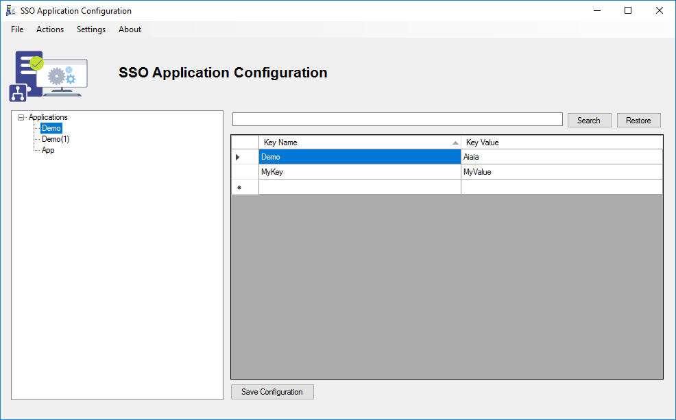

# BizTalk Server SSO Application Configuration Tool
BizTalk Server leverages the Enterprise Single Sign-On (SSO) capabilities for securely storing critical information such as secure configuration properties (for example, the proxy user ID, and proxy password) for the BizTalk adapters. Therefore, BizTalk Server requires SSO to work properly. BizTalk Server automatically installs SSO on every computer where you install the BizTalk Server runtime.

But it also can keep your own application configuration data in SSO database, let say the usual configurations that we normally keep in a configuration file (“app.config”)). If you’ve been in the BizTalk world long enough, you’ve probably faced this challenge or need and until 2009 there wasn’t an easy way to archive that and Richard Seroter’s BizTalk SSO Configuration Data Storage Tool was the go tool to store and manage Single Sign-On (SSO) applications - this is still a valid tool and if you rebuild the code in the last version of BizTalk Server it still works perfectly. 

In mid-2009 Microsoft released an MMC snap-in to tackle this exact issue: SSO Configuration Application MMC Snap-In provides the ability to add and manage applications, add and manage key-value pairs in the SSO database, as well as import and export configuration applications so that they can be deployed to different environments. It wasn't nor is it the perfect tool in my opinion since it as several UI limitations but it worked perfectly until... a new version of BizTalk Server was released.

Unfortunately, this tool will not work properly at least from BizTalk Server 2013 forward. At first sight, it seems that everything is working properly but when you try to create a key-value pair you will see that nothing happens and no key is created.

To workaround this problem, some community members published a hotfix for the tool:
* [BizTalk Server 2013: Fix for SSO Configuration Application MMC Snap-In](https://gallery.technet.microsoft.com/BizTalk-Server-2013-Fix-41f3b1e3)
* [BizTalk Server 2013 R2: Fix for SSO Configuration Application MMC Snap-In](https://gallery.technet.microsoft.com/BizTalk-Server-2013-R2-Fix-5a790391)
* [BizTalk Server 2016: BizTalk Server 2016: Fix for SSO Configuration Application MMC Snap-In](https://gallery.technet.microsoft.com/BizTalk-Server-2016-Fix-12784c1f).

In part, these hotfixes solved the issue but we recently realized that the tool even with the hotfix doesn't work properly in multiple environments and to try to uninstall the Microsoft snap-in after the hotfix is "installed" it is a nightmare.

Again, Richard Seroter tool is a great tool but is not fully compatible with Microsoft tool and in some parts. This tool is designed to suppress that "limitation" and designed to "recreate" and improve SSO Application Configuration and the result is this:

* Fully resizable windows (you will understand if you are a BizTalk Developer);
* You can securely export and import Application configurations and it is compatible with MSFT SSO snap-in;
* You can duplicate Applications (copy and past);
* You can rename Applications;
* You can easily add new key-values without the need to always perform a right click and select new key option;
* You can easily add edit key-values without the need to always perform a double-click to open a new window;
* You can refresh the Applications tree view
* You can search!

THIS TOOL IS PROVIDED "AS IS", WITHOUT WARRANTY OF ANY KIND.

# About Us
Sandro Pereira | [DevScope](http://www.devscope.net/) | MVP & MCTS BizTalk Server 2010 | [https://blog.sandro-pereira.com/](https://blog.sandro-pereira.com/) | [@sandro_asp](https://twitter.com/sandro_asp)

Rui Pinho | [DevScope](http://www.devscope.net/) | BizTalk Server Developer
